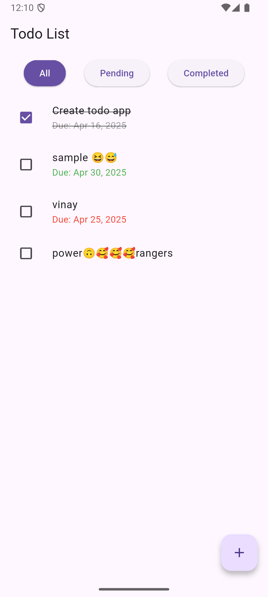
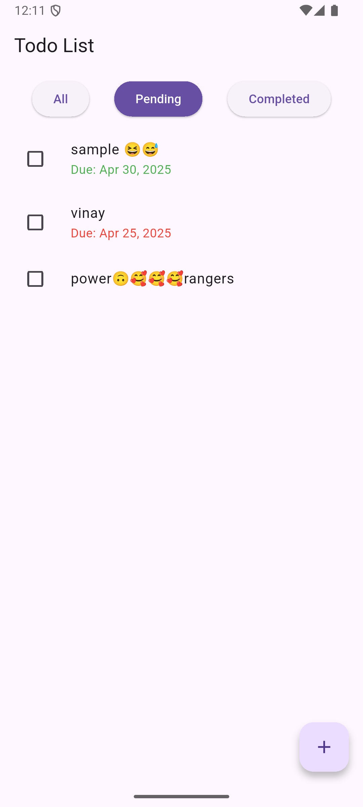
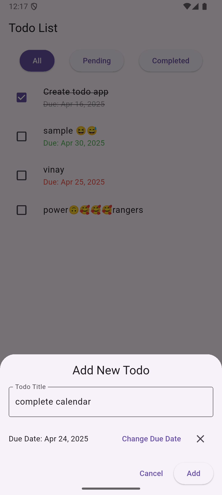
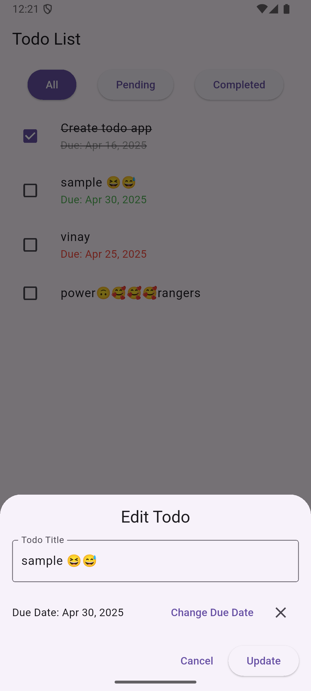

# Flutter Todo App with Drift

A Flutter todo application built with Drift database for local storage and Riverpod for state management.

## Features

- Create, read, update, and delete todo tasks
- Filter tasks by status (All, Pending, Completed)
- Mark tasks as completed
- Persistent storage using Drift database
- Clean architecture with repository pattern
- State management with Riverpod

## Screenshots

| All | Pending | Completed |
|-----|---------|-----------|
|  |  |  |

| Add Todo | Edit Todo |
|----------|-----------|
|  |  |

## Project Structure

- `lib/database/` - Drift database configuration and tables
- `lib/pages/` - UI screens 
- `lib/providers/` - Riverpod providers for state management
- `lib/repository/` - Data access layer
- `lib/service_locator.dart` - Dependency injection setup

## Technologies Used

- Flutter
- Drift (previously known as Moor) - SQLite database
- Flutter Riverpod - State management
- Get It - Dependency injection

## Getting Started

1. Clone the repository
2. Run `flutter pub get`
3. Run `flutter run`

## Dependencies

- flutter_riverpod
- drift
- get_it
- intl
