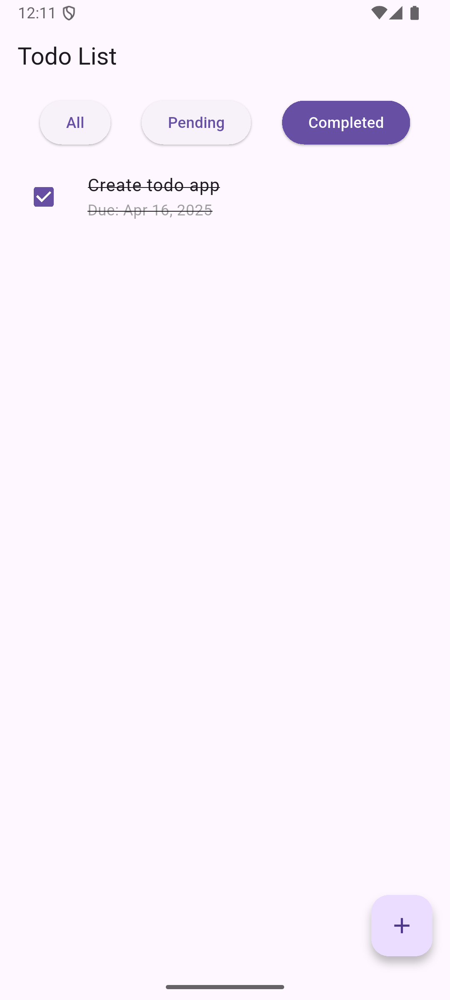

# Flutter Todo App with Drift

A Flutter todo application built with Drift database for local storage and Riverpod for state management.


## Features

- Create, read, update, and delete todo tasks
- Filter tasks by status (All, Pending, Completed)
- Mark tasks as completed
- Persistent storage using Drift database
- Clean architecture with repository pattern
- State management with Riverpod
- Dynamic theme switching (Light/Dark mode)
- Cross-platform support (Android, iOS, Windows, Mac, Linux)

## Screenshots

| All | Pending | Completed |
|-----|---------|-----------|
|  |  |  |

| Add Todo | Edit Todo |
|----------|-----------|
|  |  |

## Project Structure

- `lib/database/` - Drift database configuration and tables
- `lib/pages/` - UI screens 
- `lib/providers/` - Riverpod providers for state management
- `lib/repository/` - Data access layer
- `lib/service_locator.dart` - Dependency injection setup
- `lib/theme/` - App theme configuration

## Technologies Used

- Flutter
- Drift (previously known as Moor) - SQLite database
- Flutter Riverpod - State management
- Get It - Dependency injection

## Getting Started

1. Clone the repository
   ```bash
   git clone https://github.com/vinaysarupuru/flutter_todo_drift.git
   cd flutter_todo_drift
   ```

2. Install dependencies
   ```bash
   flutter pub get
   ```

3. Run the app
   ```bash
   flutter run
   ```

## Building for Release

### Android

To build an optimized APK, make sure to update your `android/app/build.gradle.kts` file:

```gradle
android {
    // ...existing configuration...
    ndkVersion = "27.0.12077973"
    
    buildTypes {
        release {
               isMinifyEnabled = true
               isShrinkResources = true
        }
    }
}
```

Then build with:
```bash
flutter build apk --release --split-per-abi
```

This will generate the following APK files in the `release/android` directory:
- [`app-arm64-v8a-release.apk`](release/android/app-arm64-v8a-release.apk) - For devices with ARM64 architecture (most modern devices)
- [`app-armeabi-v7a-release.apk`](release/android/app-armeabi-v7a-release.apk) - For devices with older ARM architecture
- [`app-x86_64-release.apk`](release/android/app-x86_64-release.apk) - For x86_64 devices (mainly emulators)

### iOS
```bash
flutter build ios --release
```

### Desktop
```bash
# For Windows
flutter build windows --release

# For macOS
flutter build macos --release

# For Linux
flutter build linux --release
```

## Pre-built Releases

You can find pre-built release files in the [`release`](release) directory:

### Android
- [`release/android/app-arm64-v8a-release.apk`](release/android/app-arm64-v8a-release.apk) - For most modern Android devices
- [`release/android/app-armeabi-v7a-release.apk`](release/android/app-armeabi-v7a-release.apk) - For older Android devices
- [`release/android/app-x86_64-release.apk`](release/android/app-x86_64-release.apk) - For x86_64 Android devices and emulators

## Platform Support

The app works on:
- Android
- iOS
- Windows
- macOS
- Linux

Note: There are some limitations with the web version due to how Drift operates in web environments.

## Dependencies

- flutter_riverpod
- drift
- get_it
- intl
- shared_preferences